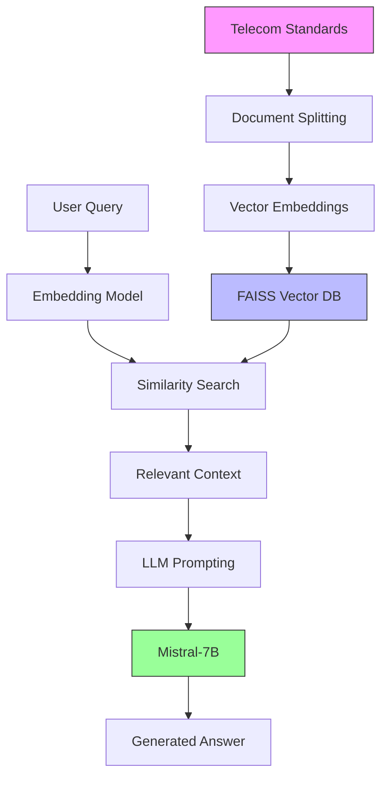

# RAG-based Telecom Standards Chatbot

## Overview
This Retrieval-Augmented Generation (RAG) system provides expert-level answers to telecom standards questions by combining document retrieval with large language model capabilities. Designed for 5G and O-RAN documentation, it mimics functionality described in research papers while using modern NLP tools.

## Key Features
- Document ingestion pipeline for telecom standards
- FAISS vector database for efficient similarity search
- Mistral-7B instruction-tuned language model
- Context-aware question answering
- Configurable retrieval parameters
- LangChain integration for RAG workflow

## Implementation Details

### Document Processing
```python
# Sample standards loading
telecom_standards = [
    "5G NR: 3GPP TS 38.300 - Overall architecture",
    "O-RAN: O-RAN Architecture Description v07.00...",
    # ... other standards
]

# Text splitting configuration
text_splitter = CharacterTextSplitter(chunk_size=500, chunk_overlap=100)
```

### Embedding and Vector Store
```python
embedding_model = HuggingFaceEmbeddings(model_name="sentence-transformers/all-MiniLM-L6-v2")
vector_store = FAISS.from_documents(documents, embedding_model)
```

### LLM Configuration
```python
model_name = "mistralai/Mistral-7B-Instruct-v0.2"
tokenizer = AutoTokenizer.from_pretrained(model_name)
model = AutoModelForCausalLM.from_pretrained(model_name, 
                   torch_dtype=torch.bfloat16, device_map="auto")
```

### RAG Prompt Template
```python
RAG_PROMPT_TEMPLATE = """[INST] 
You are a telecom standards expert. Use the following context:
{context}
Question: {question}
Answer: 
[/INST]"""
```

## Usage
1. Install dependencies:
```bash
pip install langchain faiss-cpu transformers torch
```

2. Run the chatbot:
```bash
python rag_chatbot.py
```

### Example Output
```
Question: What is the O-RAN architecture?
Answer: The O-RAN architecture consists of Non-Real Time RIC, Near-Real Time RIC, 
O-CU (Centralized Unit), O-DU (Distributed Unit), and O-RU (Radio Unit) components, 
as defined in the O-RAN Architecture Description document v07.00.
```

## Mathematical Foundation
The RAG model combines retrieval and generation:
```
p(answer|question) = Σ p(retrieve doc|question) * p(generate answer|doc, question)
```

Similarity search uses cosine distance:
```
similarity(q,d) = (q·d)/(||q|| ||d||)
```

## References
1. [Mistral 7B Paper](https://arxiv.org/abs/2310.06825)
2. [LangChain RAG Documentation](https://python.langchain.com/docs/)
3. [3GPP Specification Portal](https://www.3gpp.org/)
4. [O-RAN Architecture Documents](https://www.o-ran.org/)
5. [Original RAG Paper](https://arxiv.org/abs/2005.11401)

## System Architecture

